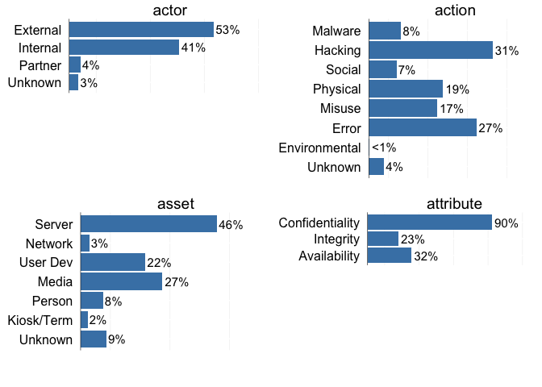
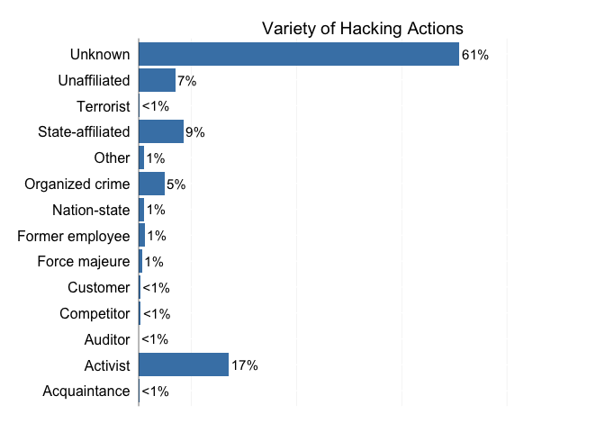

verisr
======

This package is to support data analysis within the VERIS framework (<http://veriscommunity.net>). It is intended to work directly with raw JSON and can be used against the VERIS Community Database (VCDB) found at (<http://veriscommunity.net/doku.php?id=public>) and (<https://github.com/vz-risk/VCDB>).

This package has two purposes. First is to convert one or more directories of VERIS (JSON) files into a usable object (in this version it is currently a data.table, but I hope to move to a dplyr object). Second, it offers a set of convenience functions for doing basic information retrieval from the object.

Install it from straight from github:

``` {.r}
# install devtools from https://github.com/hadley/devtools
library("devtools")
install_github("verisr", "jayjacobs")
```

To begin, load the package and point it at a directory of JSON files storing VERIS data.

``` {.r}
library(verisr)
vcdb.dir <- "../VCDB/data/json/"
# may optionally load a custom json schema file.
vcdb <- json2veris(vcdb.dir)
```

What json2veris() returns is a plain data.table object, which enables you (the developer) to work directly with the data.

``` {.r}
class(vcdb)
```

    ## [1] "verisr"     "data.table" "data.frame"

``` {.r}
dim(vcdb)
```

    ## [1] 3527 1652

There are several convenience functions to get a feel for what's in the current verisr object.

``` {.r}
summary(vcdb)
```

    ## 3527 incidents in this object.

    ##       actor                action            asset     
    ##  External:2009   Environmental:   4   Kiosk/Term:  79  
    ##  Internal:1287   Error        : 834   Media     : 902  
    ##  Partner : 162   Hacking      :1152   Network   : 113  
    ##  Unknown : 133   Malware      : 303   Person    : 278  
    ##                  Misuse       : 600   Server    :1674  
    ##                  Physical     : 755   Unknown   : 280  
    ##                  Social       : 257   User Dev  : 822  
    ##                  Unknown      : 152                    
    ##                                                        
    ##            attribute   
    ##  Availability   :1174  
    ##  Confidentiality:3193  
    ##  Integrity      : 795  
    ##                        
    ##                        
    ##                        
    ##                        
    ##                        
    ## 

``` {.r}
plot(vcdb)
```

    ## Loading required package: ggplot2



Let's look for a specific variable:

``` {.r}
ext.variety <- getenum(vcdb, "actor.external.variety")
print(ext.variety)
```

    ##                 enum    x    n      freq
    ##  1:     Acquaintance    2 2009 0.0009955
    ##  2:        Terrorist    2 2009 0.0009955
    ##  3:       Competitor    5 2009 0.0024888
    ##  4:         Customer    5 2009 0.0024888
    ##  5:    Force majeure   11 2009 0.0054754
    ##  6:     Nation-state   13 2009 0.0064709
    ##  7:            Other   20 2009 0.0099552
    ##  8:  Former employee   25 2009 0.0124440
    ##  9:  Organized crime   81 2009 0.0403186
    ## 10:     Unaffiliated  131 2009 0.0652066
    ## 11: State-affiliated  180 2009 0.0895968
    ## 12:         Activist  342 2009 0.1702339
    ## 13:          Unknown 1196 2009 0.5953211

And we could create a barplot with ggplot:

``` {.r}
library(ggplot2)
gg <- ggplot(ext.variety, aes(x=enum, y=x))
gg <- gg + geom_bar(stat="identity", fill="steelblue")
gg <- gg + coord_flip() + theme_bw()
print(gg)
```


or use a built-in function to do the same thing (but a little prettier).

``` {.r}
print(simplebar(ext.variety, "Variety of Hacking Actions"))
```



Filters have changed
====================

The way filters are handled are different. The old function of getfilter() has been removed, it would just return a vector of logicals the same length as the verisr object which would indicate which records to use. Since you have the data (the verisr object is just a data.table) and all the enumerations are logical values, it should be trivial to create a filter. For example, to filter on all the incidents with confirmed data loss, and then further filter for hacking vector of web appliation...

``` {.r}
# see the docs on data.table for getting columns like this
ddfilter <- vcdb[["attribute.confidentiality.data_disclosure.Yes"]]
webfilter <- vcdb[["action.hacking.vector.Web application"]]
# now we can combine with | or & ("or" and "and" respectively)
# to filter incidents with confirmed data loss and web vector:
ddweb <- ddfilter & webfilter
```

Since these are just logical vectors now, we can use sum() to see how many matches.

``` {.r}
cat("Confirmed data loss events:", sum(ddfilter), "\n")
```

    ## Confirmed data loss events: 2036

``` {.r}
cat("Hacking vector of web apps:", sum(webfilter), "\n")
```

    ## Hacking vector of web apps: 588

``` {.r}
cat("Both data loss and web app:", sum(ddweb), "\n")
```

    ## Both data loss and web app: 297

Special names added to verisr object
====================================

Most of the names to query are obvious from the schema. Things like "actor.external.motive" for example is relatively intuitive. But when the verisr object is created there are several more fields dervied from the data to make queries easier. Those are:

-   *actor* will return top level actor categories
-   *action* will return top level action categories
-   *asset.variety* will return top level asset categories
-   *attribute* will return top level asset categories
-   *victim.industry2* will return the first 2 digits of the NAICS code
-   *victim.industry3* same, first 3 digits
-   *victim.orgsize* returns "Large" and "Small" enumerations

If you come across any more that you'd like added, please reach out.

Querying Multiple Enumerations
==============================

One rather fun feature of the lastest version is the ability to query for an enumeration as it relates to one or more other enumerations. For example, if you wanted to create a A2 grid, which compares the action categories to the asset categories, it's a single query:

``` {.r}
a2 <- getenumby(vcdb, c("action", "asset.variety"))
head(a2)
```

    ##        enum  enum1   x    n    freq
    ## 1:  Malware Server 218 3527 0.06181
    ## 2:  Hacking Server 978 3527 0.27729
    ## 3:   Social Server 195 3527 0.05529
    ## 4: Physical Server  38 3527 0.01077
    ## 5:   Misuse Server 368 3527 0.10434
    ## 6:    Error Server 235 3527 0.06663

And we can now just visualize that with ggplot in a nice 2x2 grid


    ##    user  system elapsed 
    ##  27.256   0.249  28.036
